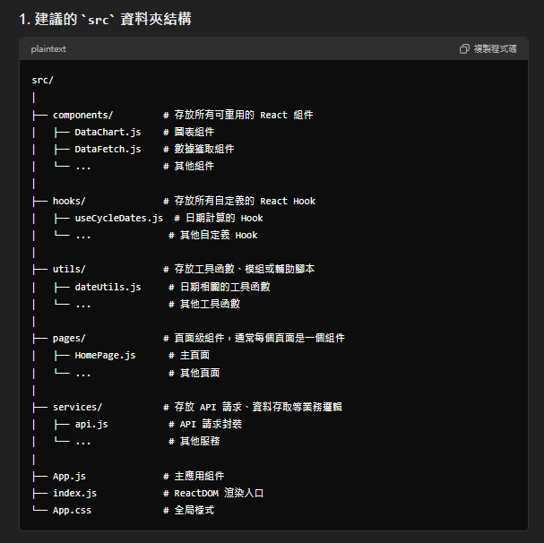

Todo
_期貨契約_網頁原始檔案
https://www.taifex.com.tw/cht/3/futContractsDateExcel

_期貨大額交易人未沖銷部位結構表_網頁原始檔案
https://www.taifex.com.tw/cht/3/largeTraderFutQryTbl

三大法人-總表
https://www.taifex.com.tw/cht/3/totalTableDateExcel

三大法人-區分各期貨契約
https://www.taifex.com.tw/cht/3/futContractsDateExcel

請用繁體中文與台灣地區慣用的方式回答我

我的目的是透過爬蟲蒐集台灣股市的盤後數據，數據包含股票`期貨`選擇權`等等資訊.

但目的是會有一個響應式的前端介面,讓我每日可以執行這個程式.並開始蒐集資料.並透過一個簡易的互動式介面,可以視覺化的呈現今日與昨日的比較,以及這周的股市籌碼變化

目前使用Visual Studio Code進行專案

IDE : Visual studio code
後端資料蒐集與處理 : Python
後端框架 : Flask + sqlalchemy
Dataabase : PostgreSQL
前端框架 : React + ChartJS

CSS 框架(TBD) :
Bootstrap：提供預設樣式和響應式佈局，使用方便，可以搭配 React 一起使用。
Tailwind CSS：提供實用性優先的工具類別，讓你可以快速定制樣式。
UI 框架(TBD) :
Material-UI：為 React 提供了一組基於 Material Design 的元件，可以讓你快速建立現代風格的使用者介面。
Ant Design：提供了豐富的 UI 元件，適合構建企業級應用。

部署平台(TBD):
Heroku（適合初學者）：提供免費的部署方案，支援 Flask 和 React。
Vercel（適合前端）：專為前端應用設計，但也支援全端應用。
AWS（Amazon Web Services）：提供更強大的自定義和擴展選項，例如 EC2（虛擬機器）、S3（靜態檔案儲存）、RDS（資料庫服務）。
Google Cloud Platform：提供類似 AWS 的服務，例如 Compute Engine、App Engine 等。
DigitalOcean：提供簡單的虛擬機器和應用程式部署服務。

該如何選擇

1.

2. 資料夾的詳細說明
components/:

存放所有可重用的 React 組件。這些組件通常是無狀態（stateless）的，但也可以包含部分狀態邏輯。
例如：DataChart.js 用於展示圖表，DataFetch.js 用於數據獲取等。
hooks/:

存放所有自定義的 React Hook。這些 Hook 封裝了複雜的邏輯，可以在多個組件中重用。
例如：useCycleDates.js 封裝了日期計算的邏輯。
utils/:

存放各種輔助函數或模組，這些函數通常與特定業務無關，僅用於簡化邏輯。
例如：dateUtils.js 可以存放日期操作相關的函數。
pages/:

存放頁面級別的組件。這些組件通常是應用的主要路由入口。
例如：HomePage.js 是應用的主頁組件。
services/:

存放與業務邏輯相關的代碼，如 API 請求、資料存取等。這些服務層的代碼通常與具體的 UI 無關。
例如：api.js 可以封裝所有與後端交互的 API 請求。